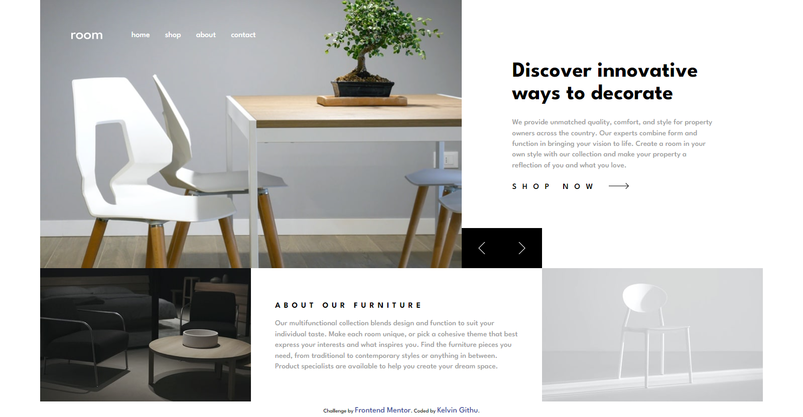

# Frontend Mentor - Room homepage

## Welcome! 👋

Thanks for checking out this front-end coding challenge.

[Frontend Mentor](https://www.frontendmentor.io) challenges help you improve your coding skills by building realistic projects.

**To do this challenge, you need a basic understanding of HTML, CSS and JavaScript.**

## The challenge
Faced a challenge  in the sliders
 ### What  i used to complete  this  project\
 - HTML
 - SCSS
 - JS

- Flexbox
- Grid
- PixelPerfect